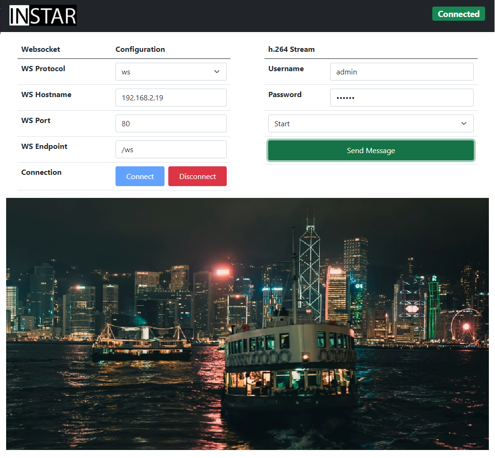

# Websocket Video Client

This is a frontend client for the INSTAR WQHD (`IN-9408 2k+`) camera websocket server. It connects to the server and displays the camera's live video stream inside an HTML5 video tag.

## Usage

1. Open the HTML file inside your web browser (or drop it and the 2 `.js` and logo `.svg` file into the public dir of a web server).
2. The page needs an internet connection to download the necessary Bootstrap 5 and Notie.js files (but you can also re-link them from a local location).
3. Type in the IP address, port and websocket URL of your INSTAR camera.
4. Click on the blue Connect button and then send the `Start` signal with the green Send Message button.

* [see also full article](https://mpolinowski.github.io/devnotes/2021-09-08--websockets-html-video)
* [NGINX WebProxy for your camera stream](https://github.com/mpolinowski/docker_ws_video_proxy)

